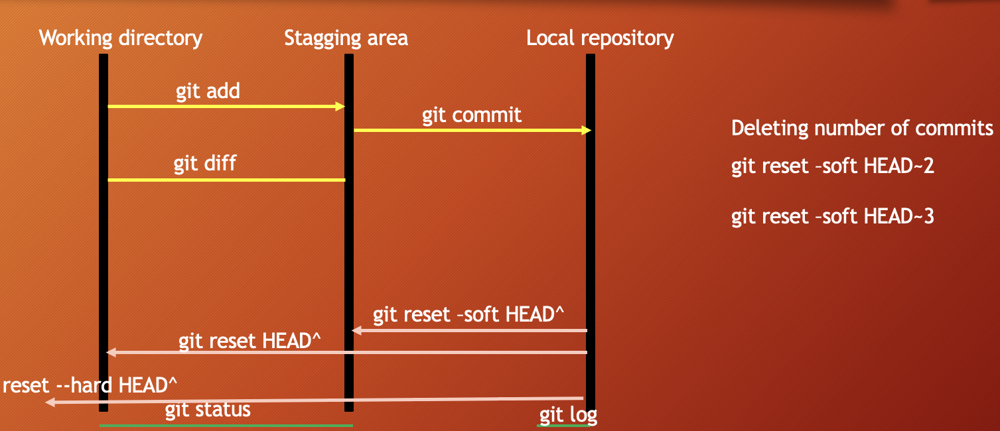

# Git & GitHub DOCUMENTATION

Thanks for visiting my GitHub account!

 **GitHub** is a developer platform that allows developers to create, store, manage and share their code. It uses Git software, providing the distributed version control of Git plus access control, bug tracking, software feature requests, task management, continuous integration, and wikis for every project. [more](https://www.w3schools.com/css/)

### [Code-Example](https://github.com/learnwithfair/github)

## Source Code (Download)

[Click Here](https://mega.nz/folder/RGFiUApD#PoKIVCwF8IkQhE2PHw1XxQ)

## Required Software (Download)

- Git, Download ->https://git-scm.com/download/win

## Project Overview

|                                       |
| :-----------------------------------: |
|             Git & Github              |
|  |

1. git?
   - git is a version control software
   - It keep track of code changes
   - It helps to collaborate in a project
   - It is installed and maintained locally
   - It provides Command Line Interface (CLI)
   - Released in April 7, 2005
   - Developed by Linus Torvalds & Junio C Hamano
2. github?
   - GitHub is a hosting service where we can keep our git repositiory/folders
   - It is maintained on cloud/web
   - It provides Graphical User Interface (GUI)
   - Founded in 2008


## One Step Back
```bash
cd ../
```


  
## Repository Upload Command

```bash
…or create a new repository on the command line
echo "# Laravel-restaurant" >> README.md
git init
git config --global --add safe.directory 'E:/Programming File/Cpp (++)  Programming' (Optional)
git add README.md
git commit -m "first commit"
git branch -M main
git remote add origin https://github.com/learnwithfair/laravel-restaurant.git
git push -u origin main


…or push an existing repository from the command line
git remote add origin https://github.com/learnwithfair/laravel-restaurant.git
git branch -M main
git push -u origin main

### If fetch any error then try as-

git branch --set-upstream-to=origin/main main
git pull origin main --allow-unrelated-histories
git push -u origin main


##########
to check brance -> git brance -a
Change Brance git checkout branceName
more details -> git cheat sheet

```
## Option A
# 🛠️ GitHub CLI Setup Guide for Windows 11

This guide explains how to install, configure, and use the GitHub CLI (`gh`) on Windows 11, including authentication and cloning private repositories.

---

## ✅ 1. What is GitHub CLI?

The GitHub CLI (`gh`) lets you use GitHub features like:
- Cloning repositories
- Creating issues and pull requests
- Authenticating with GitHub
- Managing your projects

It works directly from the command line or terminal inside VS Code.

---

## ✅ 2. Install GitHub CLI on Windows 11

### 🔹 Step 1: Download the Installer

- Visit: [https://cli.github.com/](https://cli.github.com/)
- Click on **Windows** to download the `.msi` installer.

Direct link: https://github.com/cli/cli/releases/latest

### 🔹 Step 2: Run the Installer

- Open the downloaded `.msi` file.
- Proceed with **default settings**.
- Finish installation.

---

## ✅ 3. Verify Installation

Open **Command Prompt** or **VS Code Terminal** and run:

```bash
gh --version
```

You should see something like:

```bash
gh version 2.50.0 (2025-05-22)
```

---

## ✅ 4. Authenticate with GitHub

Run the login command:

```bash
gh auth login
```

You’ll be prompted to:
- Choose GitHub.com
- Choose `HTTPS`
- Authenticate in browser

Follow the instructions → copy the URL → paste into browser → login with GitHub → authorize the CLI.

If successful, you’ll see:

```bash
✓ Logged in as learnwithfair
```

---

## ✅ 5. Clone a GitHub Repo

You can now clone any public or private repository (if you have access):

```bash
gh repo clone learnwithfair/Carento-customization
```

---

## ✅ 6. List Your Repositories

```bash
gh repo list
```

Example output:

```bash
learnwithfair/awesome-project           Public
learnwithfair/top-secret-project        Private
```

---

## ✅ 7. More Useful Commands

| Command            | Description                                |
|--------------------|--------------------------------------------|
| `gh repo view`     | View current repo info                     |
| `gh repo fork`     | Fork a repository                          |
| `gh pr create`     | Create a new pull request                  |
| `gh issue list`    | List all issues in the current repo        |
| `gh repo create`   | Create a new GitHub repo from the CLI      |
| `gh auth logout`   | Logout from GitHub                         |

---

## 🧠 Tip

If you're a **collaborator on a private repo**, `gh` is the easiest way to clone and work with it — no need to handle tokens or SSH manually.

---

## ✅ Uninstalling (Optional)

To uninstall:
- Open **Control Panel → Programs → Uninstall a Program**
- Select **GitHub CLI** and click Uninstall

---

## 📌 Done!

You're now ready to manage GitHub from your terminal like a pro 🚀


## Option B
### [Lesson 3. How to set git environment and configuration](https://youtu.be/vj5-nkhTRbo)

- create a GitHub account
- [setup ssh](https://youtu.be/ykLd4YQMzCo?si=hS4bShi16XfD4n5y) :
  - type in terminal `for generating SSH Key: ssh-keygen -t ed25519 -C "your email goes here"`
  - type in terminal `cat ~/.ssh/id_ed255519.pub`
  - copy the ssh and add to github
- Download and install git on your pc: https://git-scm.com/
- check git version: open terminal or cmd then use the command `git --version` to find out whether git is installed or not. if git is installed it will return a version number of git.

### git configuration

1.  check all configuartion options: `git config`
2.  set global user name and user email for all repository/git folders (if you want to set different username and email for different git repository then remove --global)
    - set global user name: `git config --global user.name "anisul-islam"`
    - set global user email: `git config --global user.email "anisul2010s@yahoo.co.uk"`
3.  list all git configuration:
    - list all the configuration: `git config --list`
    - list user name: `git config user.name`
    - list user email: `git config user.email`
4.  change global username & email
    - change global user name: `git config --global user.name "PUT_NEW_USER_NAME_HERE"`
    - change global user email: `git config --global user.email "PUT_NEW_USER_EMAIL_HERE"`

<br/>

### [Lesson 4. creating git repo and adding new files](https://youtu.be/oa6viOCTEeM)

1.  creating a git folder

- ls -a : list all files inside of a directory

  ```
  mkdir DIRECTORY_NAME_HERE
  cd DIRECTORY_NAME_HERE
  git init

  Example:
  mkdir notes
  cd notes
  git init
  ls -a
  ```

2.  adding new files in git folder

- git status : displays the state of the working directory and staging area

  ```
  ls -a
  touch fileName.extension
  open fileName.extension
  git status

  Example:
  touch day1.txt
  open day1.txt
  write something inside the file
  ```

- Git is aware of the file but not added to our git repo
- Files in git repo can have 2 states – tracked (git knows and added to git repo), untracked (file in the working directory, but not added to the local repository)
- To make the file trackable stagging or adding is required

<br/>

### [Lesson 5. how to add files in staging area & remove files](https://youtu.be/IDhgZX4esQQ)

1.  adding files to stagging area:

- `git add fileName` add a file in staging area / index
- `git add .` add all files of directory to stagging area not subdirectory
- `git add -A` add all files of directory and subdirectory to stagging area
- `git rm --cached fileName` unstage a file from staging area
- `git diff` - checking the differences of a staged file
- `git restore fileName` - restore the file

<br/>

### [Lesson 6. practice-1](https://youtu.be/jSj-GF-utls)

<br/>

### [Lesson 7. commit & uncommit](https://youtu.be/gmBKbxKGcn8)

- `git commit -m "message"` move the file to local repository from stagging area
- `git log` check the commit history
- `git reset --soft HEAD^` uncommit the commit in HEAD and move to staging area
- `git reset HEAD^` uncommit the commit in HEAD and move to unstaging / working area
- `git reset --hard HEAD^` uncommit the commit in HEAD and delete the commit completely with all the changes



<br/>

### [Lesson 8. git HEAD and undo theory](https://youtu.be/xUNsecljvog)

- `git log --oneline`
- `git show`
- `git show HEAD^`
- `git show commit-id`
- `git checkout commit-id`
- `git checkout master`

<br/>

### [Lesson 9. git HEAD and undo practical](https://youtu.be/rEoeC-HBqws)

<br/>

### [Lesson 10. git revert]()

<br/>

### [Lesson 11. git ignore](https://youtu.be/CKla6oWTezM)

- create a .gitignore file and add the things you do not want to add in the stagging area
- Inside .gitignore we can keep secret files, hidden files, temporary files, log files
- `secret.txt` secret.txt will be ignored
- `*.txt` ignore all files with .txt extension
- `!main.txt` ignore all files with .txt extension without .main.txt
- `test?.txt` ignore all files like test1.txt test2.txt
- `temp/` all the files in temp folders will be ignored

<br/>

### [Lesson 12. how to create github repository and commits](https://youtu.be/HRVNOjl9e5U)

- sign in to your github account
- create a git repo

<br/>

### [Lesson 13. README.md](https://youtu.be/bl0-DTgh-mw)

[README video is here](https://youtu.be/bl0-DTgh-mw)

- Everything you need to know about README.md is discussed in the video.
- 6 heading levels: number of hashes define heading levels. check the following examples:
  - `# heading 1 level text is here`
  - `## heading 2 level text is here`
- bold syntax: `**text goes here**`
- italic syntax: `_text goes here_`
- bold and italic syntax: `**_text goes here_**`
- strikethrouh syntax: `~~this is~~`
- single line code syntax: `` place code inside backticks
- multiple line code syntax: ``` place code inside three open and closing backticks
- multiple line code syntax language specific: ```html for specific lanaguage use language name when starting; not closing
- Ordered List syntax

      ```
           1. HTML
            2. CSS

               1. Fundamental
               2. CSS Architecture - BEM
               3. CSS Preprocessor - SASS

            3. JS
      ```

- Unordered List syntax ->
  ```
   - html
   - css
     - Fundamental
     - CSS Architecture - BEM
     - CSS Preprocessor - SASS
   - js
  ```
- Task List
  ```
     - [x] Task1
     - [x] Task2
     - [x] Task3
  ```
- adding link

  ```
     <!-- automatic link -->

     http://www.studywithanis.com

     <!-- markdown link syntax -->
     [title](link)
     [studywithanis](http://www.studywithanis.com)
     [studywithanis][websitelink]

     <!-- all link is here  -->

     [websitelink]: http://www.studywithanis.com

  ```

- adding image syntax -> ``
  ``

- adding emoji  
   [emoji src](https://getemoji.com/) ### Smileys
  😀 😃 😄 😁 😆 😅 😂 🤣 🥲 ☺️ 😊 😇 🙂 🙃 😉 😌 😍 🥰 😘 😗 😙 😚 😋 😛 😝 😜 🤪 🤨 🧐 🤓 😎 🥸 🤩 🥳 😏 😒 😞 😔 😟 😕 🙁 ☹️ 😣 😖 😫 😩 🥺 😢 😭 😤 😠 😡 🤬 🤯 😳 🥵 🥶 😱 😨 😰 😥 😓 🤗 🤔 🤭 🤫 🤥 😶 😐 😑 😬 🙄 😯 😦 😧 😮 😲 🥱 😴 🤤 😪 😵 🤐 🥴 🤢 🤮 🤧 😷 🤒 🤕 🤑 🤠 😈 👿 👹 👺 🤡 💩 👻 💀 ☠️ 👽 👾 🤖 🎃 😺 😸 😹 😻 😼 😽 🙀 😿 😾

      ### Gestures and Body Parts
      👋 🤚 🖐 ✋ 🖖 👌 🤌 🤏 ✌️ 🤞 🤟 🤘 🤙 👈 👉 👆 🖕 👇 ☝️ 👍 👎 ✊ 👊 🤛 🤜 👏 🙌 👐 🤲 🤝 🙏 ✍️ 💅 🤳 💪 🦾 🦵 🦿 🦶      👣 👂 🦻 👃 🫀 🫁 🧠 🦷 🦴 👀 👁 👅 👄 💋 🩸

- adding table
  ```
     table syntax
     | heading1 | heading2 |
     | ----- | ----- |
     | data1 | data2 |
     | data3 | data4 |
     | data5 | data6 |
  ```

<br>

### [Lesson 14. Connecting local repo to remote repo](https://youtu.be/sLX2YWYpkAc)

- check remote connection: `git remote` or `git remote -v`
- `git remote add name <REMOTE_URL>` example: git remote add origin http://...
- to clone a remote repository: `git clone <REMOTE_URL>`

<br>

### [Lesson 15. push and pull](https://youtu.be/UXEoCfYwI1Q)

- push a branch `git push -u origin branch_name`
- push all branches `git push --all`
- pull from a repo: `git pull` which is equivalent to git fetch + git merge

<br>

### [Lesson 16. branching and merging](https://youtu.be/3k8Bq_usPsk)

- Branch is a new and separate branch of the master/main repository, which allows you parallel development.
- Branching allows you to diverge from the main line of development and continue working on a separate line of code without affecting the main codebase. When you create a branch, you essentially create a copy of the code at a certain point in time, and you can make changes to this copy independently of other branches. Branches are often used for developing new features, fixing bugs, or experimenting with changes.
- Merging is the process of combining the changes from one branch (the source branch) into another (the target branch). This allows you to incorporate the changes made in one branch back into the main codebase or another branch. When you merge branches, Git automatically integrates the changes, resolving any conflicts that may arise if the same part of the code was modified in both branches.
- create a branch `git branch branch_name`
- List branches `git branch`
- List all remote branches `git branch -r`
- List all local & remote branches `git branch -a`
- move to a branch `git checkout branch_name`
- create and move to a branch `git checkout -b branch_name`
- delete a branch: `git branch -d branch_name`
- merge branches:
  ```
    git checkout branchName
    git merge branchName
  ```
- `git log --oneline --all --graph`

<br>

### [Lesson 17. branching and merging locally](https://youtu.be/AhBxGYzdWI0)

<br>

### [Lesson 18. git and GitHub practice - 2](https://youtu.be/IHVzseHh3Bo)

<br>

### [Lesson 19. GitHub Issues](https://youtu.be/E5HFlpx7QP4)

<br>

### [Lesson 20. 2-way and 3-way merges]()

- Reeference:
  - https://www.tutorialspoint.com/what-is-a-fast-forward-merge-in-git
  - https://www.tutorialspoint.com/what-is-3-way-merge-or-merge-commit-in-git
  - https://medium.com/@koteswar.meesala/git-fast-forward-merge-vs-three-way-merge-8591434dd350

### [Lesson 21. Merge Conflicts]()

- https://www.tutorialspoint.com/what-is-merge-conflict-in-git-how-to-handle-merge-conflicts

### Lesson 22. Tags

In GitHub, "tags" typically refer to Git tags. Git tags are a way to mark specific points in a Git repository's history as being important or significant. They are often used to label specific commits, such as releases or version numbers, to make it easier to reference those commits in the future.

Here's how Git tags work:

1. **Creating a Tag:** You can create a Git tag by running a command like `git tag <tag-name>`, where `<tag-name>` is the name you want to give to the tag. For example, you might create a tag for a release like this: `git tag v1.0.0`.

2. **Tagging Commits:** Tags are typically associated with specific commits. When you create a tag, it's linked to the current commit, but you can also specify a different commit if needed.

3. **Listing Tags:** You can list all the tags in a Git repository using the `git tag` command.

4. **Annotated vs. Lightweight Tags:** Git supports two types of tags: annotated and lightweight. Annotated tags are recommended for most use cases because they store extra metadata like the tagger's name, email, date, and a tagging message. Lightweight tags are just a name for a specific commit and don't include extra information.

5. **Pushing Tags:** By default, when you push changes to a remote Git repository, tags are not automatically pushed. You need to use `git push --tags` to push tags to a remote repository. This is important when you want to share tags, especially when creating releases on GitHub.

6. **Using Tags on GitHub:** On GitHub, you'll often see tags associated with releases. When you create a release on GitHub, it typically creates a Git tag behind the scenes to mark the specific commit associated with that release. Users can then download or reference that release by its tag name.

GitHub also has its own concept of "releases" that are closely related to Git tags. A release on GitHub is a way to package and distribute software versions, and it often corresponds to a Git tag. When you create a GitHub release, you can upload release assets (e.g., binaries, documentation) and provide release notes.

In summary, GitHub tags are essentially Git tags, and they are used to mark important points in a repository's history, often associated with releases or significant commits. They help users easily reference and work with specific versions of a project.

### git revert

In Git, git revert is a command used to create a new commit that undoes the changes made by a previous commit. This command is helpful when you want to revert specific changes without altering the commit history.

## Follow Me

 [Facebook](http://facebook.com/learnwithfair),  [Youtube](http://youtube.com/@learnwithfair),  [Instagram](http://instagram.com/learnwithfair)
